# Openweather ETL

**Work in progress!!!**

## About The Project
Although the project is named "openweather_etl", its current implementation works more accurately as a Python-based connector that loads weather and air quality data from the OpenWeatherMap API into Google BigQuery. As such, the architecture aligns more closely with an ELT (Extract, Load, Transform) pattern rather than a traditional ETL pipeline, although the transform step is, for now, purely conceptual.

In addition to data ingestion, the project also focuses on automation: code deployment is orchestrated via GitHub Actions, while the underlying infrastructure is provisioned using Terraform. This dual approach ensures both data operations and infrastructure management are streamlined and reproducible.

## Architecture
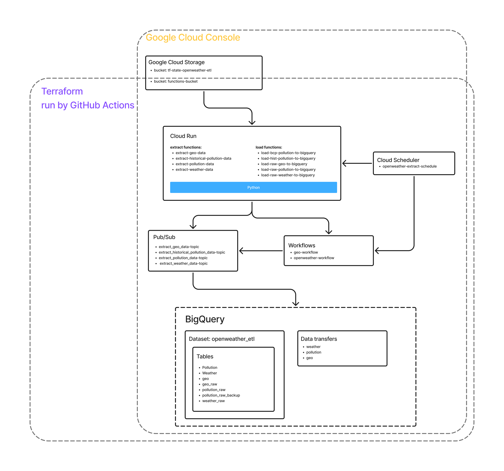

## Dataflow
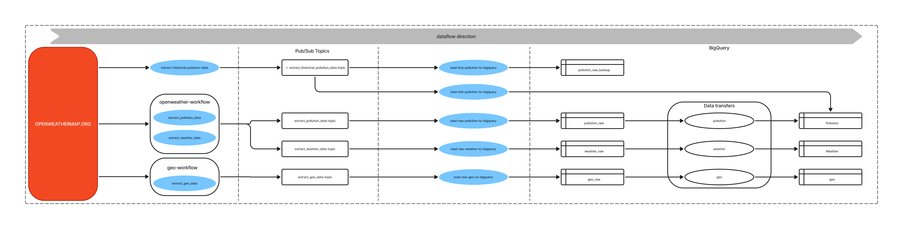

## How to deploy project on GCP
This project does not rely on a GCP organization or folder structure, as I currently do not have access to one. While those components are required for fully automated project provisioning with Terraform, this setup has been adjusted to work without them. As a result, the only requirement for getting started is having a valid GCP account.

Once your GCP account is ready, follow the steps below to set up and run the project:

### 1) Assuming you already have a GCP account, sign in to the Google Cloud Console and create a new project.
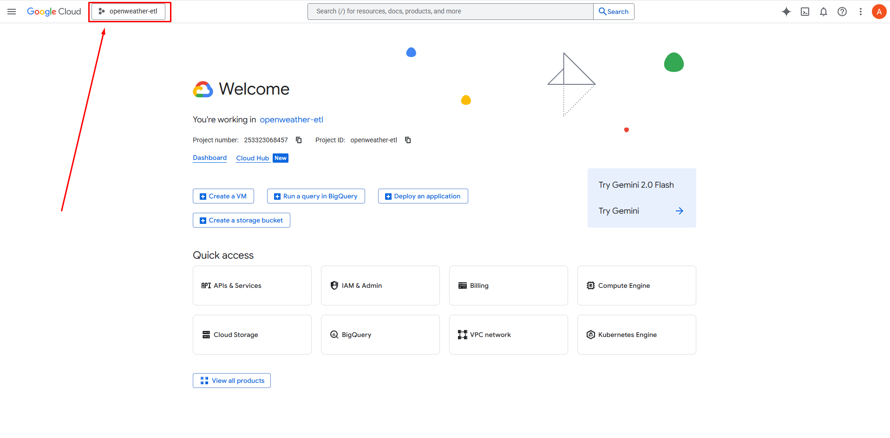
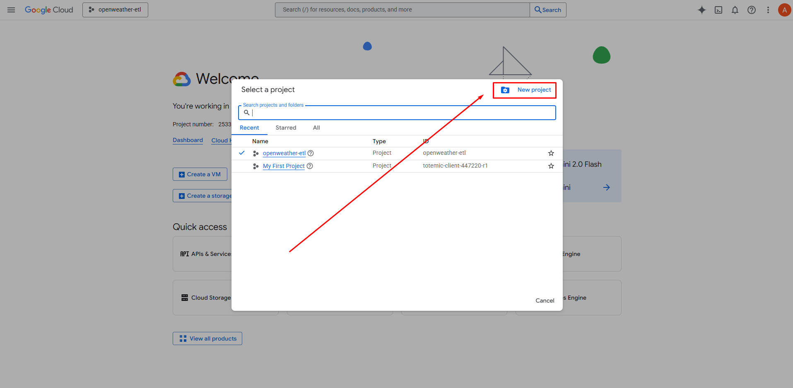
Enter a project name (be sure to note the project name, as it will be required in later steps) and click "Create".
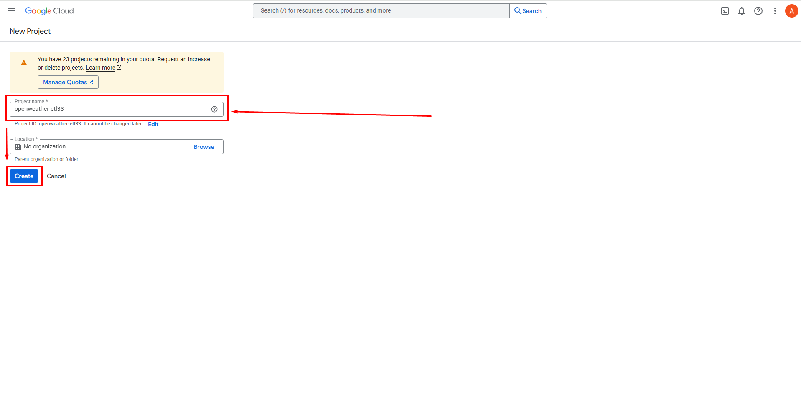
### 2) In the Google Cloud Console, switch to the newly created project and navigate to the IAM & Admin section to create a new service account.
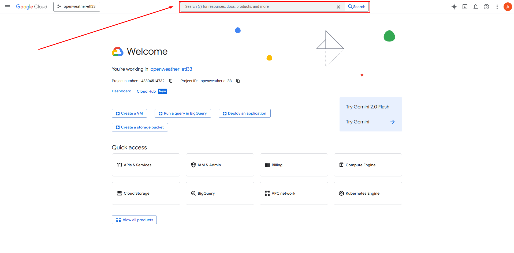
Start typing "IAM & Admin" in the search bar, then select it from the list of available options.
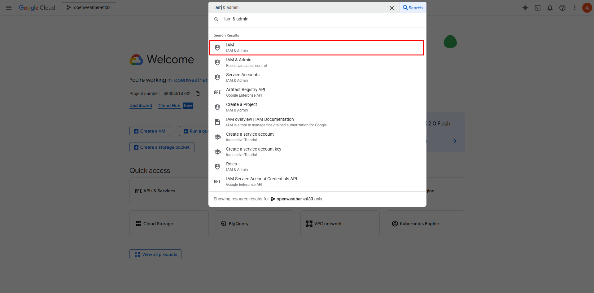
In the navigation menu on the left, click on "Service Accounts".
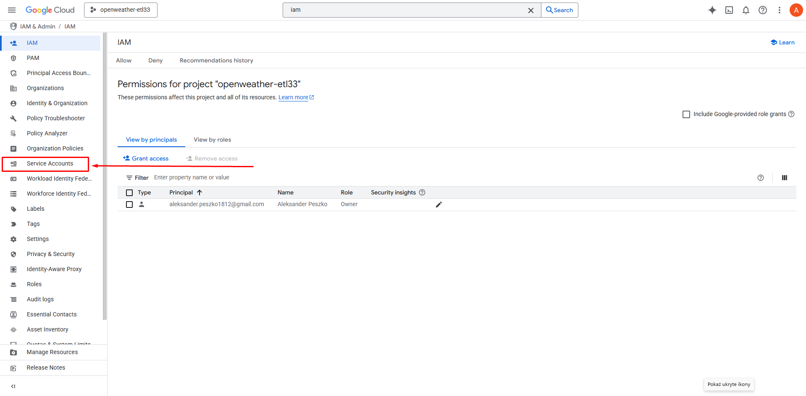
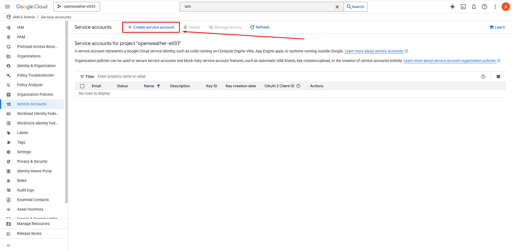
Enter an account name and click "Create and continue".
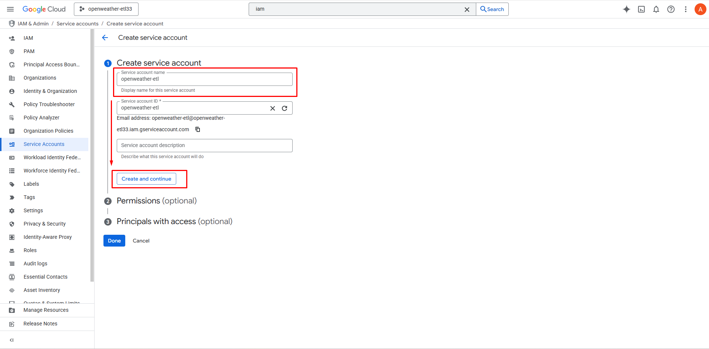
In the next step, assign the following permissions and click "Done".
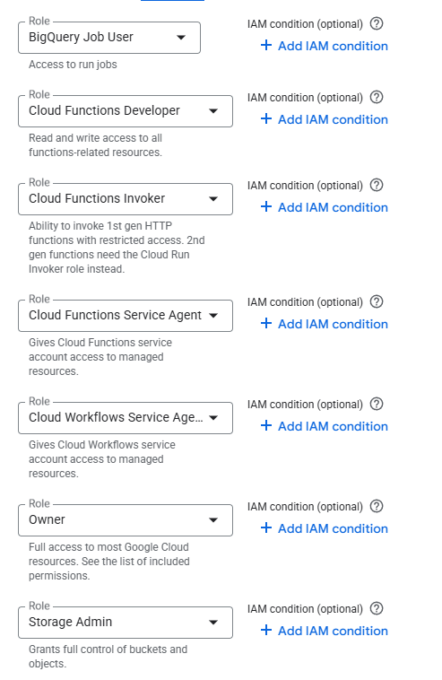
### 3) Generate a key for the service account you just created.
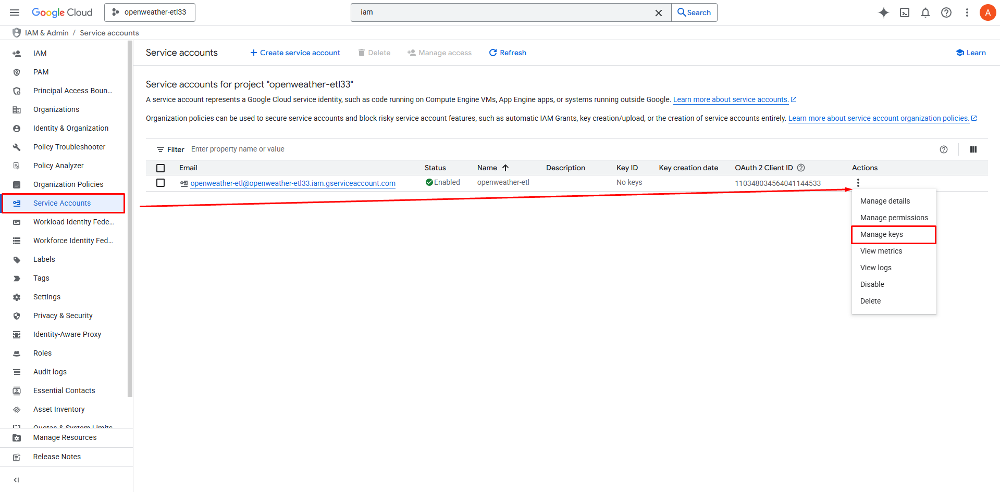
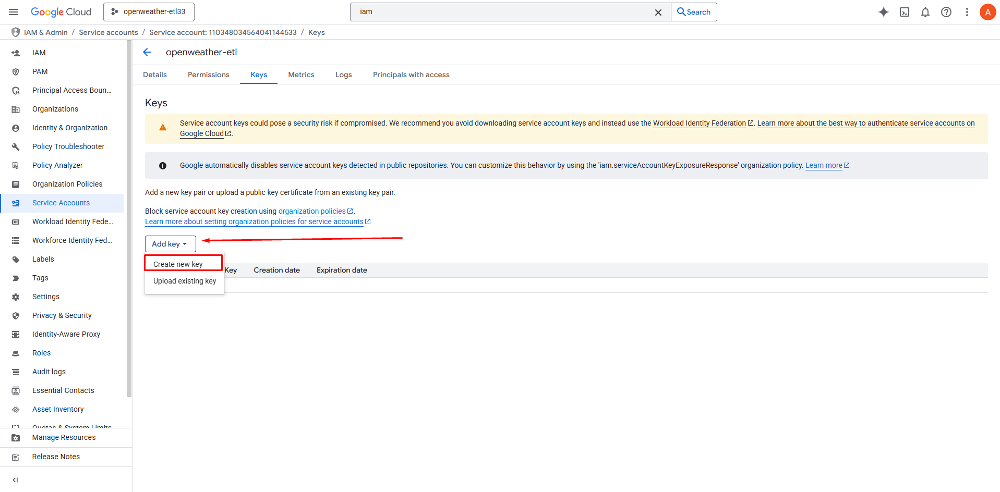
Keep the key file — you’ll need it later.
### 4) Create a Cloud Storage bucket that will be used to store the Terraform state files.
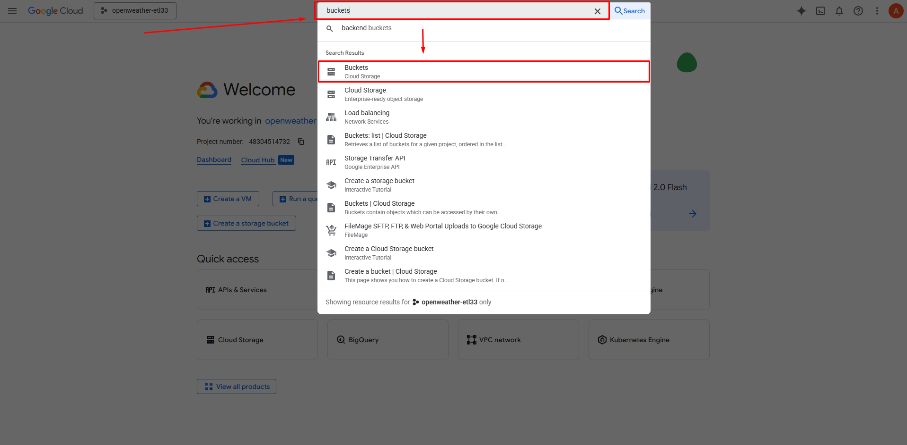
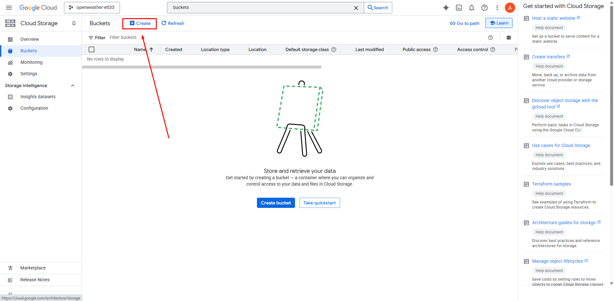
Specify a name for the bucket and record it for later use. All other bucket settings can remain at their default values.
### 5) Duplicate this repository (https://docs.github.com/en/repositories/creating-and-managing-repositories/duplicating-a-repository) and set up an environment for it on GitHub.
Next, add two secrets and three environment variables to the GitHub Actions environment you just created.

**2 secrets:**
- GCP_API_KEY          -> Paste the key generated for the service account here.
- OPEN_WEATHER_API_KEY -> Paste the API key generated on *openweathermap.org* here.

**3 variables:**
- GCP_PROJECT_ID      -> Enter the name of your GCP project here.
- TRANSFER_START_DATE -> Enter a timestamp in ISO 8601 format. It must represent a future date. This value defines the starting point from which the data transfer between BigQuery tables will be executed.
- GCP_SERVICE_ACCOUNT -> Paste the name of the service account here, prefixed with "serviceAccount:". For example:

### 6) Project setup using a code editor.
Open the config file inside the config directory.

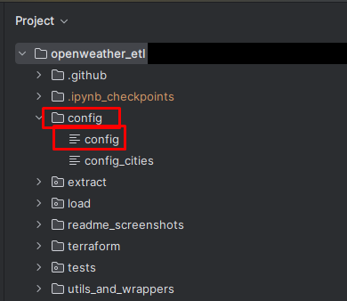

Next, set the appropriate values for the project_id and state_bucket_name parameters (use the name of the bucket created in Step 4).

After that, execute the **files_for_terraform.py** script from within the **utils_and_wrappers** directory.
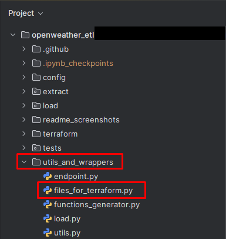

Finally, you should update the environment name in both deploy.yml and deploy_terraform.yml to match the one you created in GitHub.
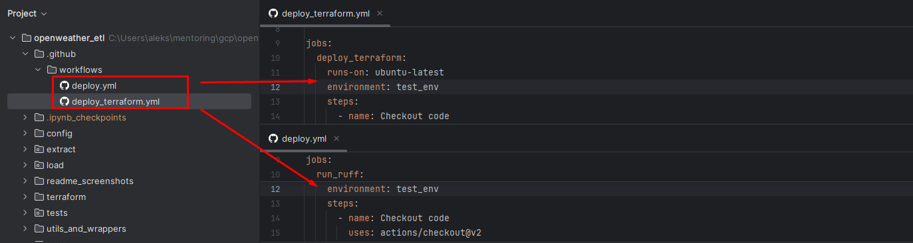
### 7) Push these changes to your repository — GitHub Actions will automatically trigger the deployment to GCP.