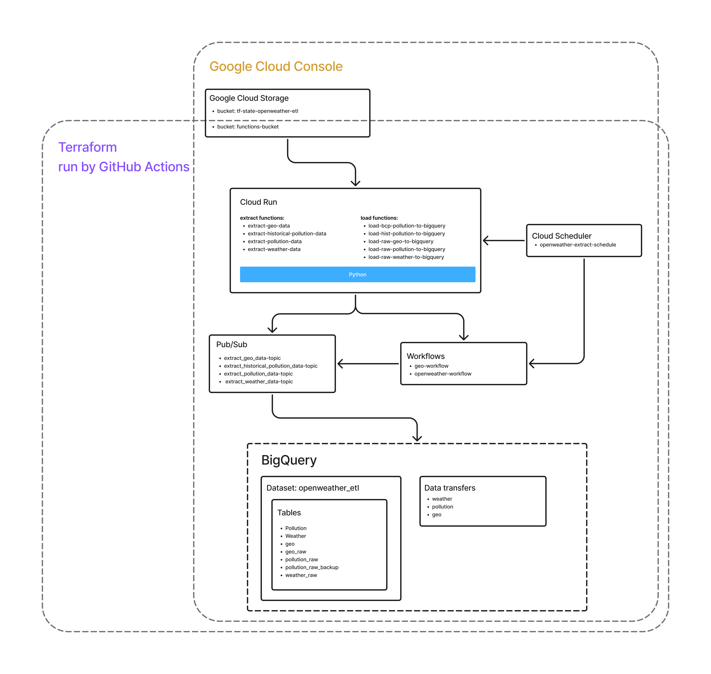

# Openweather ETL

---

## Table of contents
[1. About The Project](#About-The-Project) 
[2. Architecture Overview:](#Architecture-Overview) 
[- Main Components](#Main-Components) 
[- Dataflow schema](#Dataflow-schema) 
[- Code Structure](#Code-Structure) 
[- Infrastructure as Code](#Infrastructure-as-Code) 
[3. CI/CD Pipeline](#CICD-Pipeline) 
[4. How to deploy project on GCP](#How-to-deploy-project-on-GCP) 

---

## About The Project
Although the project is named "openweather_etl", its current implementation works more accurately as a Python-based connector that loads weather and air quality data from the OpenWeatherMap API into Google BigQuery. As such, the architecture aligns more closely with an ELT (Extract, Load, Transform) pattern rather than a traditional ETL pipeline, although the transform step is, for now, purely conceptual.

In addition to data ingestion, the project also focuses on automation: code deployment is orchestrated via GitHub Actions, while the underlying infrastructure is provisioned using Terraform. This dual approach ensures both data operations and infrastructure management are streamlined and reproducible.

---

## Architecture Overview
This project implements a modular ETL pipeline on Google Cloud Platform, designed to ingest, process, and store weather and pollution data from OpenWeatherMap.

### Main Components
- **Cloud Run (Extract & Load):**
  - **Extract Functions:** Serverless HTTP-triggered functions fetch data from external APIs (weather, pollution, geo) using strategy classes for each data type. Data is gathered for multiple cities (the cities list is defined in the `config_cities` file) and returned as JSON.
  - **Load Functions:** Serverless functions (createded with `@create_load_function` decorator) are triggered to load the extracted data into BigQuery tables. Each function targets a specific table and uses a dedicated load strategy.

- **Workflows & Scheduling:**
  - **Google Workflows:** Orchestrate the execution of extract functions, ensuring data flows through the pipeline in the correct order. The `extract_pollution_data`, `extract_weather_data` and `extract_geo_data` functions are run by workflows with collected data transfered to related Pub/Sub topics. 
  - **Cloud Scheduler:** Triggers workflows at defined intervals to automate data extraction. Additionally the `extract-historical-pollution-data` function is triggered directly by Cloud Scheduler.

- **Data Storage:**
  - **Google Cloud Storage:** Stores zipped source code for functions and acts as a staging area for deployment artifacts.
  - **BigQuery:** Central data warehouse with multiple tables for raw and processed weather, pollution, and geo data.

- **Pub/Sub:**
  - Used for asynchronous communication between extract and load stages.
  - Load functions are triggered by Pub/Sub topics.

### Dataflow schema

### Code Structure

- **Extract Strategies:** Located in `extract`, each strategy encapsulates logic for a specific data source (e.g., weather, pollution, geo).
- **Load Strategies:** Located in `load`, each strategy handles loading data of a particular type. Target table is defined as the load function's argument. 
- **Function Entrypoints:** Defined in main.py, using `functions_framework` for HTTP and event-based triggers.
- **Utilities:** Helper functions for publishing messages, endpoint management, and function generation are in utils_and_wrappers.

### Infrastructure as Code

- **Terraform:** All GCP resources (Cloud Functions, Workflows, Scheduler, BigQuery, Storage, Pub/Sub - **with exception for bucket storing .tfstate file**) are provisioned and managed via Terraform scripts in the terraform directory.

---

## CI/CD Pipeline

This project uses GitHub Actions for continuous integration and deployment, automating both code quality checks and infrastructure provisioning.

### 1. Code Quality & Linting

- **Workflow:** deploy.yml
- **Trigger:** Runs on every push (except for certain branches).
- **Steps:**
  - Checks out the repository code.
  - Sets up Python 3.8.
  - Caches pip dependencies for faster builds.
  - Installs all Python dependencies from requirements.txt.
  - Runs `ruff` to check code style and linting issues.
  - Reports any linting errors in the workflow logs.

### 2. Infrastructure as Code Deployment

- **Workflow:** deploy_terraform.yml
- **Trigger:** Runs on every push (except for certain branches).
- **Steps:**
  - Checks out the repository code.
  - Sets up Python and the Google Cloud SDK.
  - Authenticates to Google Cloud using a service account key stored in GitHub Secrets.
  - Sets up Terraform.
  - Initializes Terraform with backend configuration.
  - Validates the Terraform configuration.
  - Runs `terraform plan` to preview infrastructure changes.
  - Pulls the current Terraform state.
  - Applies the Terraform plan to provision or update GCP resources automatically.

### Secrets and Variables

- Sensitive information (GCP credentials, API keys) is securely managed using GitHub Secrets and repository/environment variables.
- The workflows use these secrets to authenticate and configure deployments without exposing sensitive data in the codebase.

---

## How to deploy project on GCP
This project does not rely on a GCP organization or folder structure, as I currently do not have access to one. While those components are required for fully automated project provisioning with Terraform, this setup has been adjusted to work without them. As a result, the only requirement for getting started is having a valid GCP account.

Once your GCP account is ready, follow the steps below to set up and run the project:

### 1) Assuming you already have a GCP account, sign in to the Google Cloud Console and create a new project.

Enter a project name (be sure to note the project name, as it will be required in later steps) and click "Create".

### 2) In the Google Cloud Console, switch to the newly created project and navigate to the IAM & Admin section to create a new service account.

Start typing "IAM & Admin" in the search bar, then select it from the list of available options.

In the navigation menu on the left, click on "Service Accounts".

Enter an account name and click "Create and continue".

In the next step, assign the following permissions and click "Done".

### 3) Generate a key for the service account you just created.

Keep the key file — you’ll need it later.
### 4) Create a Cloud Storage bucket that will be used to store the Terraform state files.

Specify a name for the bucket and record it for later use. All other bucket settings can remain at their default values.
### 5) Duplicate this repository (https://docs.github.com/en/repositories/creating-and-managing-repositories/duplicating-a-repository) and set up an environment for it on GitHub.
Next, add two secrets and three environment variables to the GitHub Actions environment you just created.

**2 secrets:**
- GCP_API_KEY          -> Paste the key generated for the service account here.
- OPEN_WEATHER_API_KEY -> Paste the API key generated on *openweathermap.org* here.

**3 variables:**
- GCP_PROJECT_ID      -> Enter the name of your GCP project here.
- TRANSFER_START_DATE -> Enter a timestamp in ISO 8601 format. It must represent a future date. This value defines the starting point from which the data transfer between BigQuery tables will be executed.
- GCP_SERVICE_ACCOUNT -> Paste the name of the service account here, prefixed with "serviceAccount:". For example:

### 6) Project setup using a code editor.
Open the config file inside the config directory.

Next, set the appropriate values for the project_id and state_bucket_name parameters (use the name of the bucket created in Step 4).

After that, execute the **files_for_terraform.py** script from within the **utils_and_wrappers** directory.

Finally, you should update the environment name in both deploy.yml and deploy_terraform.yml to match the one you created in GitHub.

### 7) Push these changes to your repository — GitHub Actions will automatically trigger the deployment to GCP.